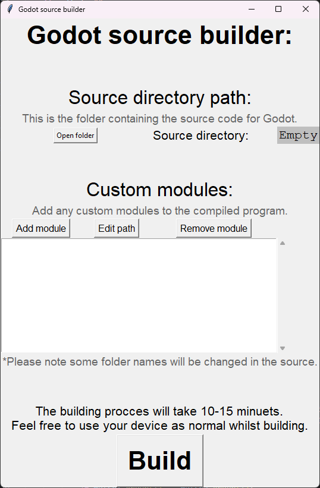

# Godot Builder

A small program used to simplify the process of building Godot from source.

## How to use

1. Download the program.
2. Select the source directory (the folder you downloaded from the Godot website)
3. Add the path of any custom modules.
4. Press build.
5. Wait an ungodly amount of time.
6. Run the generated executable.

## Getting Started

### Dependencies

* Windows

### Installing

* Install and extract the .zip file.

### Executing program

* Find the file called `godot builder.exe` and run it.

## Version History

* 1.0
  * has support for custom modules and the base source code.

## License

This project is licensed under the MIT License - see the LICENSE.md file for details
